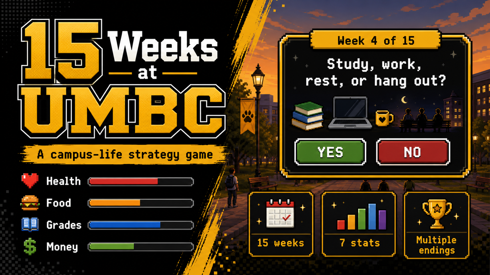

# 15 Weeks at UMBC

15 Weeks at UMBC is a complete choice-driven campus life strategy game about balancing health, food, grades, money, stress, support, and career readiness through a full UMBC semester.

## Play Online

[Play 15 Weeks at UMBC](https://jasonbinong.github.io/15-Weeks-At-UMBC/)

This repo includes:

- A finished 15-week browser game for GitHub Pages
- The original Processing sketch in `15_Weeks_At_UMBC.pde`
- Campus image assets in the `data` folder

## Features

- Six student paths: commuter, working student, first-year, transfer, honors, and student athlete
- 15 weekly decision scenarios across the semester
- Three meaningful choices per week
- Dynamic tracking for health, food, grades, money, stress, support, and career readiness
- Profile-specific events that affect the semester
- Dynamic consequences when stress, money, food, or health become unstable
- Save and continue support with browser localStorage
- Achievement system based on play style
- Semester progress tracker and final report
- Early failure states and multiple final endings
- Responsive layout for desktop and mobile

## What This Project Shows

- Interactive game design with meaningful tradeoffs
- Java/Processing fundamentals translated into a browser game
- State management across seven connected student-life variables
- Save/load logic with localStorage
- Consequence systems, achievements, and multiple endings
- User-centered design around campus life decisions

## Case Study

### Problem

College students make constant tradeoffs between studying, working, resting, eating, socializing, and taking care of their health. I wanted to turn those everyday decisions into an interactive game that makes the consequences visible.

### Solution

15 Weeks at UMBC is a semester-long decision game where players choose weekly actions and manage health, food, grades, money, stress, support, and career readiness. Each decision affects the semester, leading to different outcomes based on the player's priorities and tradeoffs.

### Key Design Decisions

- Built a 15-week structure to mirror a real semester
- Used six student paths so the experience changes based on a player's starting situation
- Added stress, support, career readiness, achievements, and save/continue to make the game feel more complete
- Added early failure states and multiple endings to make decisions meaningful
- Preserved the original Processing sketch while also creating a deployable browser version

### What I Learned

This project helped me practice programming logic, state management, interaction design, and translating a Java/Processing project into a browser-based experience. It also taught me how small design choices can make a simple game feel more complete.

### Future Improvements

- Add more event variety based on major, work schedule, or club involvement
- Add sound effects and optional music
- Add more visual polish and animations
- Expand endings with more detailed semester summaries

## Run the Browser Version

Open `index.html` in a web browser.

No installation is required.

## Deploy With GitHub Pages

1. Go to the repository's **Settings** tab.
2. Open **Pages**.
3. Under **Build and deployment**, choose **Deploy from a branch**.
4. Select the `main` branch and `/root` folder.
5. Save the settings.

## Run the Original Processing Version

1. Open `15_Weeks_At_UMBC.pde` in Processing.
2. Make sure the required photos are in the `data` folder.
3. Press Run.

## Required Photos

Processing loads images from the sketch's `data` folder. The game expects these exact filenames:

- `library.jpg`
- `lecture hall.jpg`
- `starbucks.jpg`
- `gameroom.jpg`
- `true grits.jpg`
- `the commons.jpg`
- `chesapeake.jpg`
- `gym.jpg`

If a photo is missing, the game shows an "Image not found" placeholder and prints the missing file path in the Processing console.
